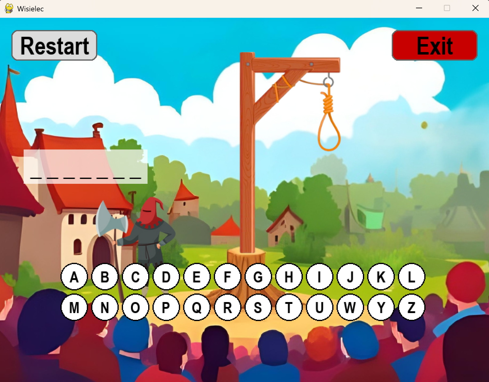
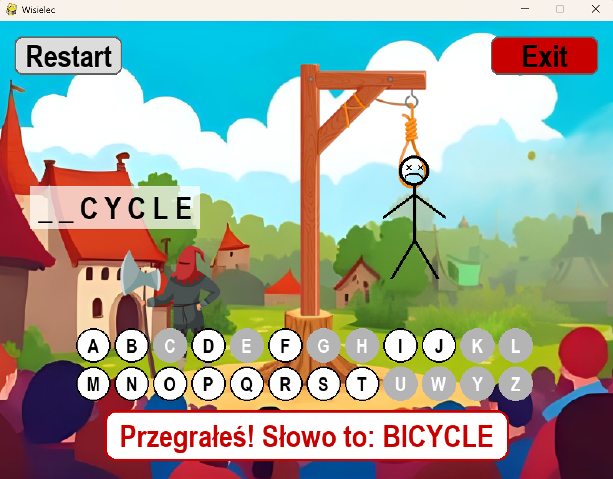
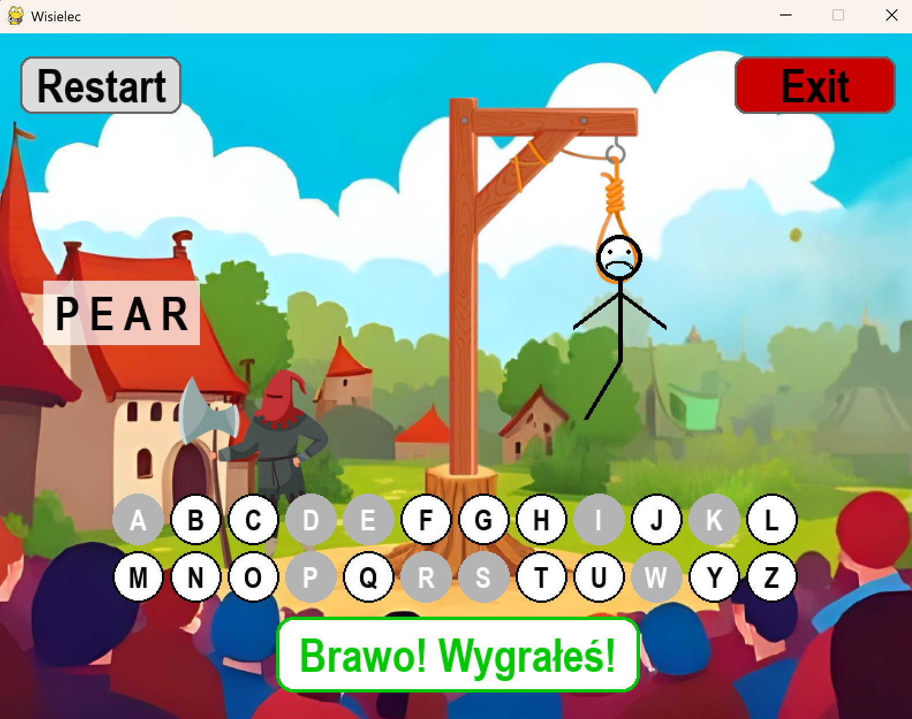

# Hangman Game (Wisielec)

Gra **Wisielec** napisana w Pythonie z wykorzystaniem biblioteki **Pygame**.
Projekt został zrefaktoryzowany do **wersji obiektowej**, co poprawia czytelność, modularność i ułatwia dalszy rozwój gry.

Celem gry jest odgadnięcie ukrytego słowa poprzez wybieranie liter alfabetu.
Każdy błąd powoduje dorysowanie kolejnego elementu wisielca. Gra kończy się, gdy odgadniesz całe słowo lub gdy zabraknie żyć.

---

## Funkcje gry

* Losowanie słowa ze słownika (`slownik.txt`).
* Rysowanie wisielca krok po kroku w zależności od liczby żyć.
* Interaktywne przyciski liter alfabetu.
* Informacja o wygranej i przegranej.
* Przyciski **Restart** i **Exit** w trakcie gry.
* Proste tło (`background.png`).
* Przejrzysta architektura obiektowa:

  * `Hangman` – główna klasa zarządzająca logiką gry.
  * `Button` – klasa dla przycisków interfejsu.
  * `LetterButton` – klasa dla liter alfabetu.
* Dodatkowo dostępna wersja gry działająca w konsoli (`wisielec.py`).

---

## Wymagania

* Python **3.8+**
* Biblioteka **pygame** (tylko dla wersji graficznej)

Instalacja Pygame:

```bash
pip install pygame
```

---

## Pliki projektu

* `wisielec-pygame.py` – główny plik gry w trybie graficznym (wersja obiektowa).
* `wisielec.py` – wersja gry działająca w konsoli.
* `slownik.txt` – plik tekstowy z listą słów (po jednym w każdej linii).
* `background.png` – obrazek tła wyświetlany w grze.

---

## Struktura kodu

Projekt został podzielony na klasy w celu lepszej organizacji kodu:

* **Hangman** – zarządza logiką gry (losowanie słowa, sprawdzanie stanu gry, rysowanie interfejsu).
* **Button** – reprezentuje przycisk w grze (np. Restart, Exit).
* **LetterButton** – rozszerza `Button`, służy do obsługi liter alfabetu.

Dzięki temu kod jest łatwiejszy do rozbudowy, np. o:

* różne poziomy trudności,
* ranking graczy,
* obsługę innych języków.

---

## Uruchomienie

1. Upewnij się, że wszystkie pliki znajdują się w tym samym folderze.
2. Aby uruchomić grę graficzną:

   ```bash
   python wisielec-pygame.py
   ```
3. Aby uruchomić grę w konsoli:

   ```bash
   python wisielec.py
   ```

---

## Sterowanie

* Kliknij **literę** na ekranie, aby sprawdzić, czy występuje w słowie (wersja graficzna).
* Kliknij **Restart**, aby zacząć od nowa (wersja graficzna).
* Kliknij **Exit**, aby wyjść z gry (wersja graficzna).
* W wersji konsolowej wpisuj litery z klawiatury.

---

## Przyszłe usprawnienia

* Dodanie **poziomów trudności** (łatwy, średni, trudny).
* Możliwość wyboru **języka słownika**.

---

## Zrzut ekranu

```markdown



```
